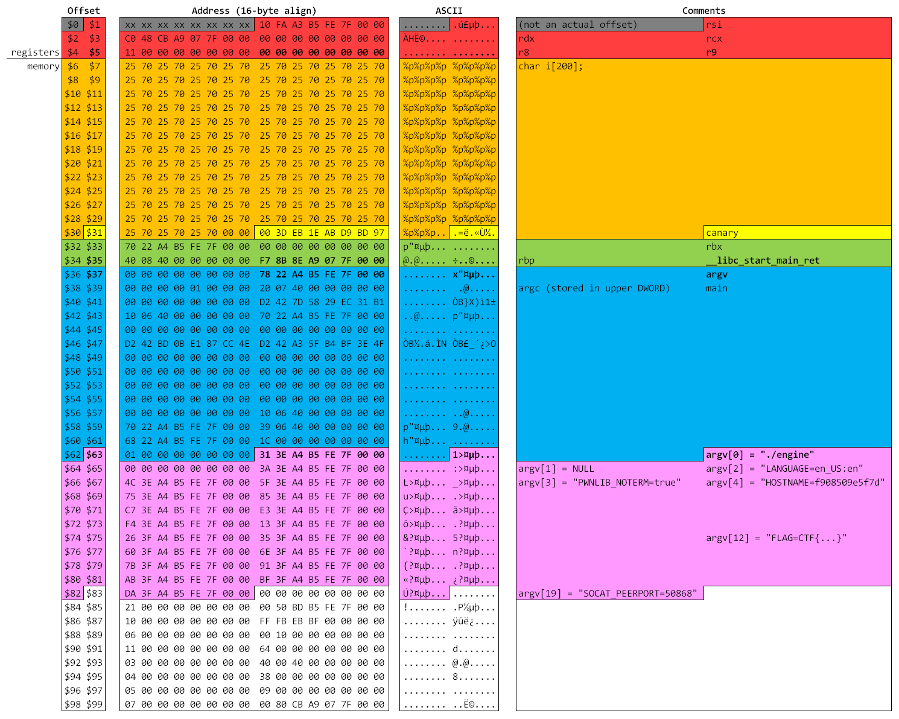
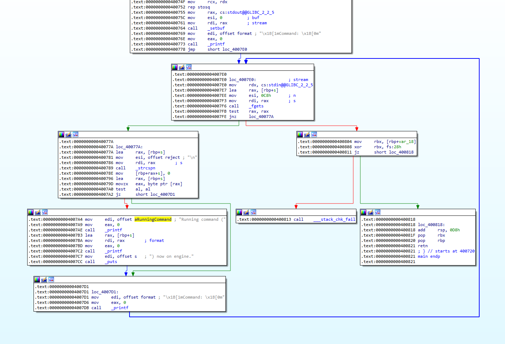

This was by far my favourite challenge of the entire Space Race CTF. I particularly enjoyed that there was minimal guesswork required, but it still required a significant amount of problem-solving to get all the pieces to work together. I did encounter a number of dead ends in solving this challenge; unfortunately I did not document these when they happened, so the write-up mainly looks I happened to do everything correctly the first time. Rest assured that is definitely not the case though.

---

In this challenge we are given some C source code that needs to be exploited (but not the binary), as well as a python wrapper.
- The python code seems pretty straightforward, it merely restricts the characters that can be input into the C code to just alphanumeric characters and punctuation. In particular, spaces are not allowed, which for our purpose will only come into play at the end of the challenge. We are also told that the python wrapper does not have an intended vulnerability, so we will ignore it henceforth.
- The C code also seems pretty straightforward: All it does is enter an infinite loop of `fgets()`-ing a string and then `printf()`-ing it back out, and pretty much nothing else.
    - Note: There is technically an exit condition when `fgets()` returns NULL, which happens when EOF is reached (i.e. stdin is closed), but it is not clear how this will interact with the python wrapper. In any case, we don't need this, as we will exit the loop a different way.

With that in mind, let's discuss some of the various parameters provided in this challenge:
- It's a standard x86-64 ELF. This means it'll follow the [calling convention of the System V AMD64 ABI](https://www.systutorials.com/x86-64-calling-convention-by-gcc/), or specifically arguments are stored in RDI, RSI, RDX, RCX, R8, R9, and any additional arguments beyond that are pushed to the stack.
- `fgets()` is allowed exactly up to the 200 bytes we reserve for the string buffer. This means that we cannot perform a buffer overflow to overwrite the return address or anything else really. Also, this actually means our string can only be 199 bytes long, to leave a NUL terminator at the end.
- `printf()` is called on the string with no other arguments. Fortunately, `printf` comes with a bunch of cool format specifiers, the particularly useful ones being:
    - `%s` to read a string (or any sequence of bytes up to a NUL byte) from a given address
    - `%p` to read a 64-bit pointer (as a hex string prefixed with `0x`, or `(nil)`
    - `%n` to write the number of bytes printed to a pointer (as a 32-bit value)
    - `%42$s` to read a string represented by the 42nd argument
    - Various size modifiers, namely `%h` for half-width and `%hh` for quarter-width

With that, let's begin. We start with a simple nc session via
```
nc portal.hackazon.org 17004
```

The very first thing we do is to leak as much of the stack as possible. Our preference here is to use `%p` since it provides the whole 64-bit value outright, compared to `%i` or `%x` which reads a 32-bit value and would thus need to be width-extended via `%li` or `%lx` respectively. Furthermore, `%p` prefixes the string with `0x`, allowing a series of `%p%p%p...%p` to be parsed into individual addresses. (In comparison, we'd need separators like `%lx-%lx-%lx` or similar to know where one value starts and another ends.) Alternatively, we could also have just chucked it into multiple queries, as in `%1$p`, `%1$2p`, and so on. But we'll keep it concise for now and chuck in a whole series of `%p%p%p...%p`. In particular, we can fit exactly 99 of these in 198 bytes. (A 100th wouldn't fit because of the NUL terminator.) Doing this returns us a series of 99 values, which we represent here as a nice memory-dump view.



Whoa! That's quite a lot to unpack right there.

As mentioned above, we know from the ABI that `printf()` is called with our buffer (`i`) stored in `rdi`, and the first 5 arguments in `rsi` to `r9`. For nice alignment reasons, we show the 0th argument in the view even though it's not actually accessible (either via `%p` or `%0$p`), but we can certainly see the first 5 arguments. Subsequent arguments are treated as being pushed to the stack, but since `printf()` did not actually push anything to the stack, we get to see the contents of the stack! So the way to read this image is as follows:
- The first gray part is invalid/unused/inaccessible. It's just there for alignment reasons to make the hex dump look nice.
- The red part are the contents of 5 registers, and are not actually in memory.
- The orange bits are the top of the stack. In particular, this stack frame is very minimal, and only consists of the 200 bytes of our `char i[200]` buffer.
- The yellow bit is the canary. This acts as a protection against a buffer overflow overwriting the return address, but we don't use this here and can ignore it.
- The green bits are the prologue of the stack frame. At this point we don't actually know this, or what the contents represent, but we infer from experience that pointer `$35` is the return address to `__libc_start_main`. We will talk a bit more about this shortly.
- The blue bits are some other stuff that gets filled when the process starts. We don't need to map all of it, but we again infer from experience that we have `argv`, `argc` and `main` in there respectively.
- Finally, the pink stuff is where some good stuff happens. This is where `argv` points to, and technically it only contains the executable and its arguments (of which there aren't any), which is why `argc` equals 1. But due to a implementation detail, environment variables are also stored immediately after this, though it's not clear if there's a variable in there to indicate just how many environment variables there are. In any case, we can just print off each of these strings in turn using the aforementioned `%42$s` format. Some of these are shown in the image to provide context.

In particular, we find that the `FLAG` environment variable is in variable `$75` (which happens to be `argv[12]`), so the solution to this could be as simple as just:
```
Command: %75$s
Running command (FLAG=CTF{5df83ee123b2541708d3913df8ee4081}) now on engine.
```

The first flag is thus `CTF{5df83ee123b2541708d3913df8ee4081}`.

---

The second part of the challenge is a lot more involved, though we have already established a good amount of groundwork above. Recall how we found an address of 0x7f07a98e8bf7 above for `__libc_start_main_ret`? This will change between runs due to libc loading into different addresses, but it always ends with `0x...bf7`. We use https://libc.blukat.me to find the libc version (using `__libc_start_main_ret = bf7`) and we get a single match of `libc6_2.27-3ubuntu1.4_amd64` with the following [table](https://libc.blukat.me/?q=__libc_start_main_ret%3Abf7&l=libc6_2.27-3ubuntu1.4_amd64):

| Symbol                | Offset   |
| --------------------- | -------- |
| __libc_start_main_ret | 0x021bf7 |
| system                | 0x04f550 |
| open                  | 0x10fd10 |
| read                  | 0x110140 |
| write                 | 0x110210 |
| str_bin_sh            | 0x1b3e1a |

Great news! We can now obtain the offsets to a whole array of functions in libc. The idea here of course is to use a [return-to-libc attack](https://en.wikipedia.org/wiki/Return-to-libc_attack) to run `system("/bin/sh")`.

Now, in order to do this, we need at the very least a way to overwrite a return address (with `system`) and a way to overwrite the `rdi` register (with `str_bin_sh`). Since we are not able to buffer overflow, the only way left to write anything is via `%n`.

The first thing to note is that `%n` works like an inverse of `%s`, that is, you need the stack variable to already be pointing to an address, then `%n` will overwrite this pointed-to location. For us to overwrite an arbitrary address, this would require us to overwrite some address on the stack that would then point to this first address. It's turtles all the way down!

Ok, so let's take a step back and think about what we want. We want a stack variable (call it A) already pointing to another stack variable (call it B), so that we can use A to overwrite B with an arbitrary address, and then use B to write whatever we want at this address. It looks like we have just the thing from the first part of the challenge -- the `argv` variable aka `$37` pointing to `$63`. That solves half the problem.

Next, we need to be able to _actually_ write any value. Recall that `%n` writes the "number of bytes printed", which is generally going to be quite a small number. We can space this out to large numbers by using alignment modifiers (e.g. `$100c` to get a string exactly 100 characters long, 99 spaces followed by the actual character), but it's still quite small. We're certainly not going to make `%n` go up to something like 0x7ffeb5a43e31. But wait, recall that `%n` only overwrites the lower 32 bits and not the full 64-bit value. This might seem like a curse initially (i.e. "how do we overwrite the higher 32 bits!?"), but is actually a blessing when you realise the opposite is also true. Not only can you use `%ln` to overwrite the full 64 bits, but you can use `%hn` and `%hhn` to overwrite only the lower 16 and 8 bits respectively.

To top it all off, it just so happens that the upper 6 bytes of `$37` and `$63` are equal in most runs (so that `argv[0]` is not too far away in the stack). So now an idea starts to form... instead of overwriting `$63` with the the final target address, we instead use it to modify the eight bytes of variable `$64`, one byte at a time, so that `$64` contains the final target address. (We picked `$64` arbitrarily, it could really be anywhere.)
- So in the example image above, we have `$37` pointing to `$63` (which is at address 0x7ffeb5a42278).
- The current value at `$63` is 0x7ffeb5a43e31, of which the upper 6 bytes are what we already want and we don't need to change it.
- Replace the lower two bytes of `$63` with 0x2280 and use this to overwrite the first byte of `$64`.
- Replace the lower two bytes of `$63` with 0x2281 and use this to overwrite the second byte of `$64`.
- ... Replace the lower two bytes of `$63` with 0x2287 and use this to overwrite the eighth (final) byte of `$64`.
- Now we have an arbitrary target address in `$64` which we can use. Hooray!

Here's the sample code for the above:
```python
def getstr(len):
    return '' if len == 0 else f'%{len}c'  # gets a string of the correct length for %n to print out

def writetmp(val): #val is 64-bit, this gets written into parameter 64
    addr = p37 + 8
    q1 = [f'{getstr(addr & 0xff00)}%37$hn']
    q2 = [x for i in range(8)[::-1] for x in (f'{getstr((addr + i) & 0xff)}%37$hhn', f'{getstr((val >> (i * 8)) & 0xff)}%63$hhn')]
    sendline(q1 + q2)
```

The main thing to note here that's different from the description above is that we write the address in reverse, from the highest (most significant) byte to the lowest. This is just an optimisation for doing this into a second layer, and isn't completely necessary.
- Specifically, if we want to write a large value that `$64` now points to (i.e. `val`), we again cannot do this all in one shot. We'd need to let `writetmp(val)` then write one byte, then let `writetmp(val+1)` then write another byte and so on until `writetmp(val+7)`. Since only the lowest byte of `$64` changes between these calls, the optimisation here is to only change the lowest byte each time (after the initial full write). This can be achieved by doing the first `writetmp()` in reverse, as we have done in the code, and then subsequent ones only poke the lowest byte.

Consequently, we can now write _any_ value (typically 64-bit values, but not limited to them) to _any_ address. Additionally, since we can use `%s` to read from an address, we can now also read from any address. All that's left now is to decide what to write and where.

A useful thing to do at this point is to leak the actual binary. We leave this as an exercise to the reader, but since we know that the binary is located at `0x400000`, we can just read off one byte at a time using `%s`. We could also optimise this process slightly since it will read as many bytes until it reaches a NUL byte, but it turns out that most of the bytes are NULs anyway. In any case, this allows us to look at the bit of the code that we want to return from/to. Here it is in IDA Pro in all its glory:



In our case, there is really only one possible return address we can overwrite, which is the `printf()` call we're in. This address will be one stack position higher than `$6` (so technically `$5` except that's pointing to a register) so that we cannot see it in our hexdump. But if we view it, it would certainly have the value `0x4007C7` which is where our `printf()` returns to.

To complete the return-to-libc, we'd need to overwrite this return address with something that pops `str_bin_sh` into `rdi` and then returns to `system`. Unfortunately there are two problems with this:
- First, it doesn't look we have that much space to maneuver here, since the stack variables immediately after the return address (`$6` and so on) are the beginning of our string buffer.
- Secondly, we can only make one `printf` call when doing this final `%n`. Consequently, we're only overwriting one or two bytes, so we cannot replace the return address with something huge for example. It'll need to be something within the executable itself.

Happily enough, we can solve both problems by simply exiting the loop. We can replace the return address to `0x400804` (which requires us to just replace the lower two bytes with `0x804`), and this pushes the problem to the next return address (which is given by the green-blue boundary in the first image). This gives us a lot more space to work with: we can replace `__libc_start_main_ret` in `$35` with a `pop rdi` gadget with `str_bin_sh` in `$36`, and `system` in `$37`? Again, there are a couple of issues:
- We don't really want to overwrite `$37` as we're using that for our gadget that targets `$63` and `$64`.
- We want our return address to be on the left of the image (e.g. `$36` or `$38` but not `$37`) because libc expects to be 16-bit aligned at the start of the function.

We solve this problem by simply allowing an arbitrary pop between `pop rdi` and `retn`. As luck would have it, it doesn't take us very long to look around `libc-2.27.so` to find the exact ROP gadget we need:
```
00022203   5F   pop rdi
00022204   5D   pop rbp
00022205   C3   retn
```
(Technically, the first opcode comes from `41 5F` or `pop r15`, but it's common to just use the second byte anyway.)

To summarise our procedure:
- We get the address of `__libc_start_main_ret` and thus all other libc addresses.
- We create a gadget to write an arbitrary address to `$64` (via `$37` and `$63`).
- We create a gadget that builds on this to write any 64-bit value to any variable on the stack.
- We write the above `pop rdi; pop rbp; retn;` address to `$35`.
- We write `str_bin_sh` to `$36`.
- We write `system` to `$38`.
- We overwrite `$64` with the address to the stack variable above `$6` (which would contain `0x4007C7`).
- We write `f'%{0x804}c%64$hn'` to overwrite the return address at `0x400804` and thus execute `system("/bin/sh")`
- PROFIT!

... Except not quite yet. We now have shell access, and we can list the files,
```
$ ls
engine    engine.py  you_are_an_amazing_hacker.txt
```
but we have the issue of not being allowed a space in our input, so something like `cat y*` is not allowed.

One way to solve the problem is to execute `system(cat)` directly instead of `/bin/sh`, but fortunately a bit of googling shows us that `${IFS}` becomes a space. Consequently, we just do
```
$ cat${IFS}y*
CTF{4ffac46e926dcadeba7d365ff2b2a9af}
```
and are rewarded with the 300-point flag, `CTF{4ffac46e926dcadeba7d365ff2b2a9af}`.

The final source code can be found in the accompanying [EngineControl.py](EngineControl.py) (which uses pwntools).